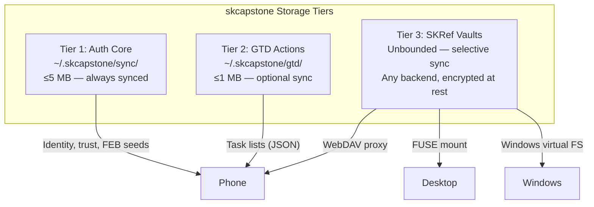
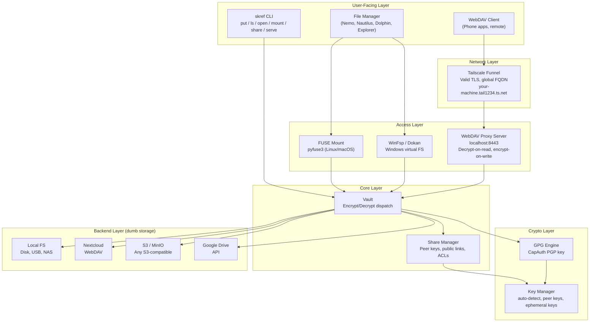
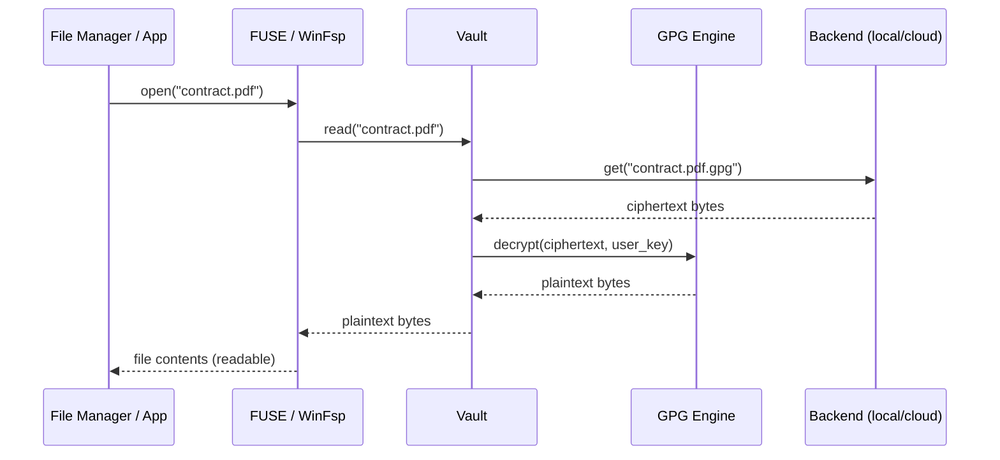
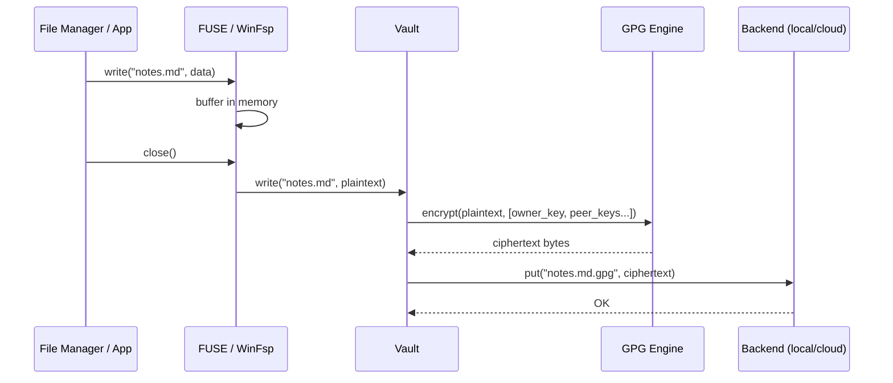
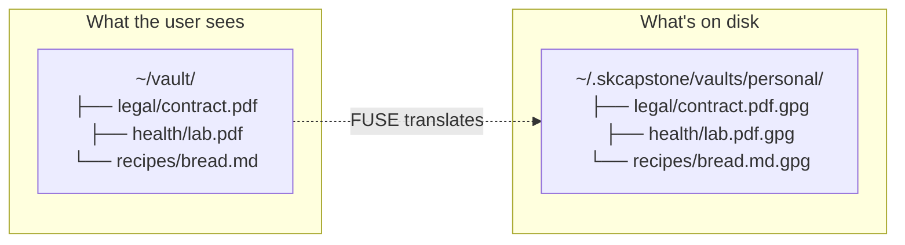
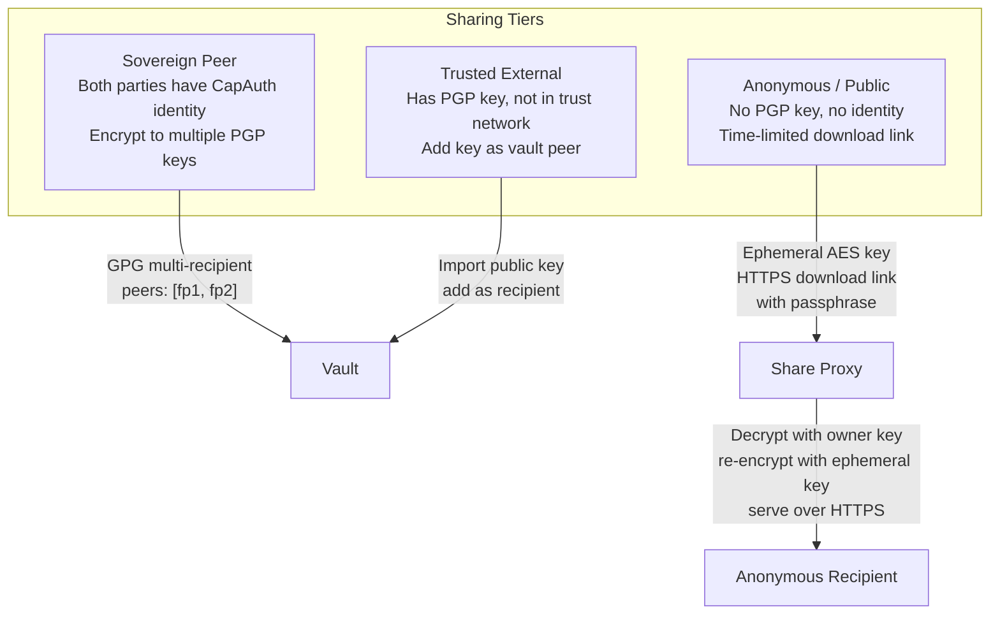
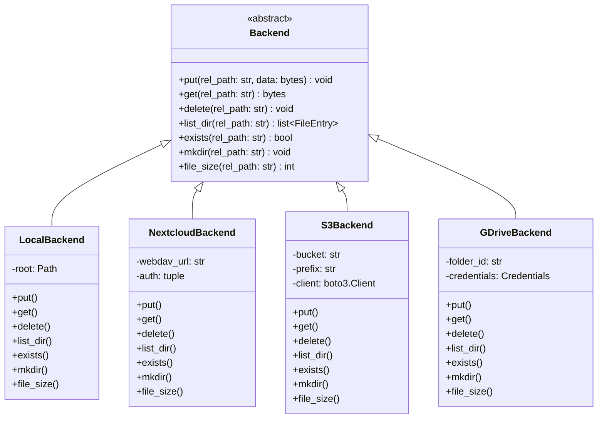
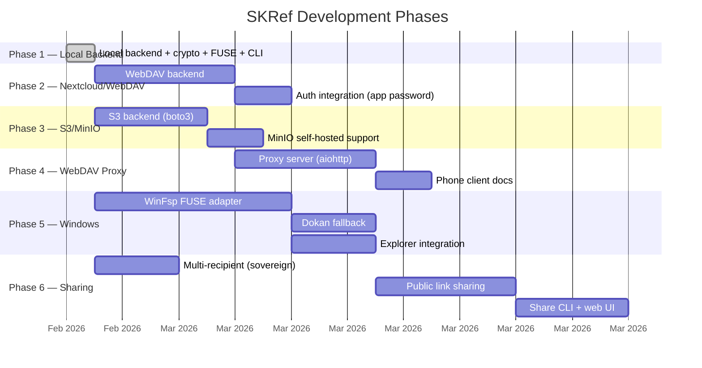
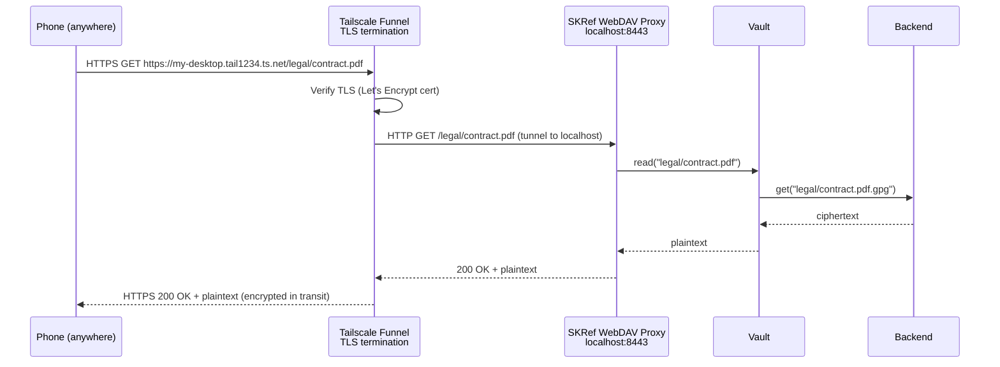
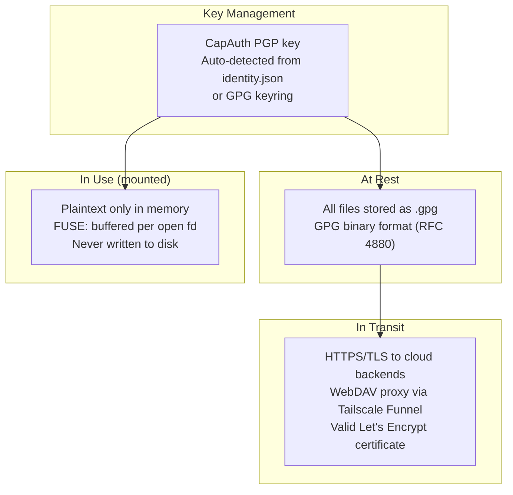

# SKRef Architecture — Sovereign Encrypted Reference Vaults

## Overview

SKRef is Tier 3 of the skcapstone sovereign agent storage model. It provides GPG-encrypted, backend-agnostic file vaults accessible through FUSE mounts (Linux/macOS), Windows virtual drives, and WebDAV proxies (phones, remote devices). Files are ciphertext at rest on any backend — your CapAuth PGP key is the only thing that unlocks them.



---

## System Architecture



---

## Data Flow: Read (Decrypt)



## Data Flow: Write (Encrypt)



---

## File Manager Integration (FUSE)

Yes — FUSE integration is seamless in Nemo, Nautilus, Dolphin, Thunar, and any GTK/Qt file manager. When you run `skref mount ~/vault`, the `~/vault` directory appears as a regular folder in your sidebar. Double-click a PDF — it decrypts, opens in your viewer. Drag a file in — it encrypts and stores. The file manager doesn't know or care that there's crypto underneath.



File managers that work out of the box:
- **Linux:** Nemo, Nautilus (GNOME Files), Dolphin, Thunar, PCManFM, Caja
- **macOS:** Finder (with macFUSE installed)
- **Windows:** Explorer (with WinFsp — see Phase 5)

---

## Sharing Model



### Sovereign Peer Sharing
Both parties have CapAuth identities. The file is encrypted to multiple PGP recipients. Both can decrypt natively. Full trust chain visible.

### Trusted External Sharing
Recipient has a PGP key but isn't in your trust network. You import their public key and add them as a vault peer. They can decrypt but aren't part of your sovereign sync.

### Anonymous / Public Sharing
Recipient has no PGP key at all. The system:
1. Decrypts the file with your key (server-side or local)
2. Generates a random AES-256 passphrase
3. Re-encrypts with the passphrase
4. Creates a time-limited HTTPS download link
5. You send the link + passphrase to the recipient via any channel

The passphrase is never stored on the server. The link expires. The original vault ciphertext is never exposed.

---

## Backend Interface Contract

Every backend implements the same dumb interface. It stores and retrieves bytes — it never sees plaintext.



---

## Configuration

All vaults configured in `~/.skcapstone/vaults.yaml`:

```yaml
default_vault: personal
identity_home: ~/.skcapstone/identity

vaults:
  personal:
    backend: local
    path: ~/.skcapstone/vaults/personal
    encrypted: true
    key: auto                    # auto-detect CapAuth PGP key
    peers: []

  work:
    backend: nextcloud
    url: https://cloud.example.com/remote.php/dav/files/user/skref/
    encrypted: true
    key: auto
    peers:
      - "AABB1122..."           # colleague's PGP fingerprint

  archive:
    backend: s3
    bucket: my-skref-archive
    region: us-east-1
    encrypted: true
    key: auto

  shared-public:
    backend: local
    path: /mnt/nas/shared
    encrypted: false             # no crypto — team-readable
```

---

## Platform Support Matrix

| Feature | Linux | macOS | Windows |
|---------|-------|-------|---------|
| CLI (init, ls, put, open) | Yes | Yes | Yes |
| GPG encrypt/decrypt | Yes | Yes | Yes (Gpg4win) |
| FUSE mount | pyfuse3 + fuse3 | pyfuse3 + macFUSE | WinFsp (Phase 5) |
| File manager integration | Nemo, Nautilus, Dolphin, etc. | Finder | Explorer |
| WebDAV proxy | Yes | Yes | Yes |
| Tailscale Funnel | Yes | Yes | Yes |
| Auto-mount on login | systemd unit | launchd plist | Task Scheduler |

---

## Phase Roadmap



---

## Tailscale Funnel — Global Access Without Port Forwarding

Tailscale Funnel is the recommended way to expose the WebDAV proxy. It replaces self-signed certificates, port forwarding, and dynamic DNS with a single command.



**How it works:**

1. `skref serve --tailscale` binds the WebDAV proxy to `127.0.0.1:8443` (localhost only)
2. `tailscale serve https / http://127.0.0.1:8443` tells Tailscale to proxy HTTPS → local HTTP
3. `tailscale funnel 8443` makes the FQDN publicly reachable from the internet
4. Tailscale provisions a valid Let's Encrypt certificate for your FQDN automatically
5. Phone connects to `https://your-machine.tail1234.ts.net/` — works from cellular, any WiFi, anywhere

**What Tailscale Funnel gives you:**

| Feature | Without Tailscale | With Tailscale Funnel |
|---------|---|---|
| TLS certificate | Self-signed (phone warns) | Valid Let's Encrypt (automatic) |
| Port forwarding | Required on router | None needed |
| DNS | Dynamic DNS or static IP | Stable FQDN on `ts.net` |
| Network access | Same LAN only | Global (internet-routable) |
| Firewall config | Manual rules | Tailscale ACLs |
| Setup complexity | ~10 steps | `--tailscale` flag |

**Integration with skcapstone setup:**

Tailscale detection is built into `src/skref/tailscale.py` and will be wired into `skcapstone install` so that:
- `skcapstone doctor` checks for Tailscale and reports FQDN
- `skcapstone install` optionally sets up Tailscale Serve + Funnel for skref
- The FQDN is stored in `~/.skcapstone/vaults.yaml` under `serve.tailscale_fqdn`

---

## Security Model



**Threat model:**
- Backend compromise (cloud provider, disk theft): attacker sees only `.gpg` ciphertext. Useless without the private key.
- FUSE mount compromise: plaintext exists only in memory for the duration of a file open/close cycle. No plaintext cache on disk.
- Key compromise: standard PGP key revocation. Re-encrypt vault with new key via `skref rekey`.
- Shared vault peer removal: re-encrypt files without the removed peer's key via `skref rekey --remove-peer`.

---

## Directory Structure

```
skref/
├── pyproject.toml
├── README.md
├── docs/
│   ├── ARCHITECTURE.md          ← you are here
│   ├── USAGE.md                 ← end-user guide
│   ├── CONTRIBUTING.md          ← developer guide
│   └── phases/
│       ├── PHASE-1.md           ← local backend (done)
│       ├── PHASE-2.md           ← Nextcloud/WebDAV backend
│       ├── PHASE-3.md           ← S3/MinIO backend
│       ├── PHASE-4.md           ← WebDAV proxy server
│       ├── PHASE-5.md           ← Windows support
│       └── PHASE-6.md           ← sharing (peers + anonymous)
├── src/skref/
│   ├── __init__.py
│   ├── models.py                ← Pydantic: VaultConfig, SkrefConfig
│   ├── config.py                ← YAML load/save
│   ├── crypto.py                ← GPG encrypt/decrypt, key detection
│   ├── vault.py                 ← Vault class (backend + crypto)
│   ├── fuse_mount.py            ← pyfuse3 FUSE filesystem
│   ├── cli.py                   ← Click CLI
│   ├── sharing.py               ← (Phase 6) share manager
│   ├── webdav_proxy.py          ← (Phase 4) WebDAV server
│   └── backends/
│       ├── __init__.py
│       ├── base.py              ← Abstract Backend interface
│       ├── local.py             ← Local filesystem backend
│       ├── nextcloud.py         ← (Phase 2) WebDAV backend
│       ├── s3.py                ← (Phase 3) S3/MinIO backend
│       └── gdrive.py            ← (Future) Google Drive backend
└── tests/
    ├── test_backend_local.py
    ├── test_config.py
    ├── test_crypto.py
    ├── test_vault.py
    ├── test_backend_nextcloud.py  ← (Phase 2)
    ├── test_backend_s3.py         ← (Phase 3)
    ├── test_webdav_proxy.py       ← (Phase 4)
    └── test_sharing.py            ← (Phase 6)
```
