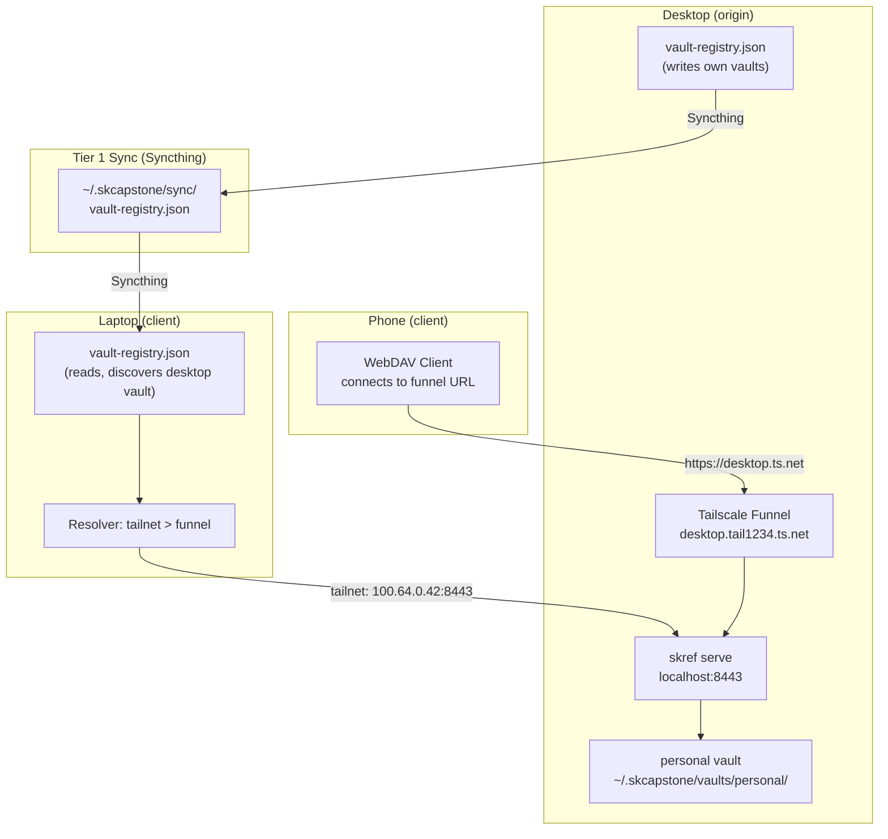
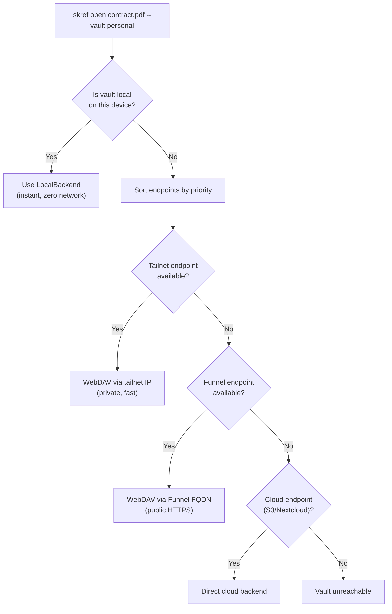
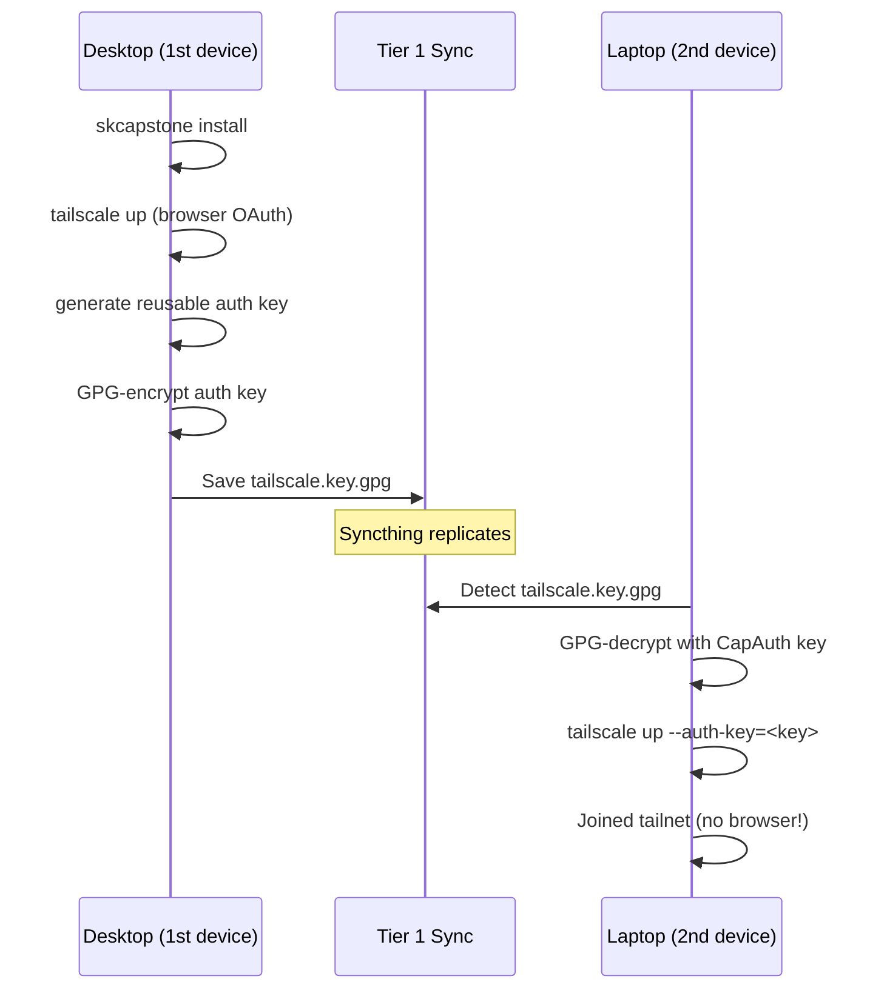

# Vault Registry — Multi-Device Vault Discovery & Resolution

## The Problem

You have three devices: a desktop, a laptop, and a phone. Your desktop has a vault called `personal` with all your encrypted files. How does your phone find it? How does your laptop know it exists? What if the desktop is off and the files are also on S3?

## The Solution

A **vault registry** — a tiny JSON file (~2 KB) synced via Tier 1 (Syncthing) to all your devices. Every device publishes its vaults and endpoints. Every device reads the registry to discover vaults on other machines. The **resolver** picks the fastest path automatically.



---

## Concepts

### Device Roles

| Role | Meaning | Example |
|------|---------|---------|
| **origin** | This device hosts the vault's backing store | Desktop with local files |
| **replica** | This device has a synced copy (future) | NAS with Syncthing mirror |
| **client** | This device accesses the vault remotely | Phone, laptop |

### Endpoints

Each vault can have multiple endpoints — different ways to reach it. The resolver tries them in priority order:

| Kind | Priority | When to use | Speed |
|------|----------|-------------|-------|
| `local` | 10 | This device IS the origin | Instant |
| `tailnet` | 20 | Same Tailscale network, private IP | ~1ms |
| `funnel` | 30 | Public HTTPS via Tailscale Funnel | ~50ms |
| `nextcloud` | 40 | WebDAV to Nextcloud server | Varies |
| `s3` | 40 | S3/MinIO direct access | Varies |

### Resolution Flow



---

## Registry File Format

Lives at `~/.skcapstone/sync/vault-registry.json` (synced via Tier 1):

```json
{
  "devices": {
    "my-desktop": {
      "hostname": "my-desktop",
      "device_id": "a1b2c3d4",
      "is_datastore": true,
      "tailscale_fqdn": "my-desktop.tail1234.ts.net",
      "tailscale_ip": "100.64.0.42",
      "funnel_enabled": true,
      "funnel_port": 8443,
      "updated_at": 1740000000
    },
    "my-laptop": {
      "hostname": "my-laptop",
      "device_id": "e5f6g7h8",
      "is_datastore": false,
      "tailscale_fqdn": "my-laptop.tail1234.ts.net",
      "tailscale_ip": "100.64.0.43",
      "funnel_enabled": false,
      "funnel_port": 8443,
      "updated_at": 1740000100
    }
  },
  "vaults": {
    "my-desktop:personal": {
      "name": "personal",
      "origin_device": "my-desktop",
      "backend": "local",
      "encrypted": true,
      "endpoints": [
        {"kind": "local",   "url": "~/.skcapstone/vaults/personal", "device": "my-desktop", "priority": 10},
        {"kind": "tailnet", "url": "http://100.64.0.42:8443/personal/", "device": "my-desktop", "priority": 20},
        {"kind": "funnel",  "url": "https://my-desktop.tail1234.ts.net/personal/", "device": "my-desktop", "priority": 30}
      ],
      "updated_at": 1740000000
    },
    "my-desktop:archive": {
      "name": "archive",
      "origin_device": "my-desktop",
      "backend": "s3",
      "encrypted": true,
      "endpoints": [
        {"kind": "s3", "url": "s3://my-archive-bucket/", "device": "my-desktop", "priority": 40},
        {"kind": "tailnet", "url": "http://100.64.0.42:8443/archive/", "device": "my-desktop", "priority": 20}
      ],
      "updated_at": 1740000000
    }
  }
}
```

**Dedup strategy:** Vaults are keyed by `{origin_device}:{vault_name}`. If two devices both have a vault called "personal", they're separate vaults. No conflict. No dedup needed.

If you want to access the same vault from multiple devices without duplication, use a cloud backend (S3, Nextcloud) as the origin — then all devices are clients to that backend. The vault registry just tells everyone where to find it.

---

## skcapstone install Integration

During `skcapstone install`, after identity and memory setup, the wizard runs the full Tailscale onboarding flow.

### First Device (No Synced Auth Key)

```
╭─ SKRef ─────────────────────────────────────────╮
│  Sovereign Reference Vault Setup                │
│                                                 │
│  SKRef gives you encrypted file vaults          │
│  accessible from any device.                    │
╰─────────────────────────────────────────────────╯

  Device: my-desktop

  Use this computer as a vault datastore? (Y/n): Y
  Datastore enabled. Vault files will live on this machine.

  Enable remote access from your phone or other computers? (Y/n): Y

╭─ What is Tailscale? ───────────────────────────────────╮
│  Tailscale creates a private mesh network between      │
│  your devices. It gives this machine a unique address  │
│  reachable from anywhere:                              │
│    https://your-machine.tail1234.ts.net                │
│  Free for personal use — up to 100 devices.            │
╰────────────────────────────────────────────────────────╯

  No synced auth key found — this appears to be your first device.
  Tailscale is not installed on this machine.
  Install Tailscale now? (recommended) (Y/n): Y
  Running: curl -fsSL https://tailscale.com/install.sh | sh
  Installing... (this may take a minute)
  Tailscale installed!

  Time to connect to your Tailscale account.
  A browser window will open for you to log in.
  (Google, GitHub, Microsoft, or email — whichever you prefer)

  Ready to open your browser? (Y/n): Y
  Opening browser for login...
  Connected!

  Your address: my-desktop.tail1234.ts.net
  Private IP:   100.64.0.42

  Generating auth key so your next device can join automatically...
  Auth key encrypted & saved → ~/.skcapstone/sync/tailscale.key.gpg
  This file will sync to other devices via Syncthing.
  Your next device will auto-join — no browser needed.

  Enable Tailscale Funnel? (Y/n): Y
  Configuring Serve + Funnel... done
  Phone URL: https://my-desktop.tail1234.ts.net:443/

  Published to vault registry.

╭─ SKRef Setup Complete ──────────────────────╮
│  Device:    my-desktop (a1b2c3d4)           │
│  Datastore: yes                             │
│  Tailscale: my-desktop.tail1234.ts.net      │
│  Funnel:    enabled (port 8443)             │
│  Config:    ~/.skcapstone/vaults.yaml       │
╰─────────────────────────────────────────────╯

Vault    Backend  Encrypted  Access
personal local    yes        local + tailnet + funnel
```

### Second Device (Auth Key Synced via Syncthing)

After Syncthing replicates `~/.skcapstone/sync/tailscale.key.gpg`:

```
  Device: my-laptop

  Use this computer as a vault datastore? (Y/n): n
  Client only. This device will access vaults on other machines.

  Enable remote access from your phone or other computers? (Y/n): Y

  Found synced auth key from another device!
  Decrypting with your CapAuth PGP key...
  Auth key decrypted. Will join your tailnet automatically.

  Tailscale is already installed.
  Joining your tailnet with synced auth key...
  Connected!

  Your address: my-laptop.tail1234.ts.net
  Private IP:   100.64.0.43

╭─ SKRef Setup Complete ──────────────────────╮
│  Device:    my-laptop (e5f6g7h8)            │
│  Datastore: no (client)                     │
│  Tailscale: my-laptop.tail1234.ts.net       │
│  Config:    ~/.skcapstone/vaults.yaml       │
╰─────────────────────────────────────────────╯

  Next steps:
    skref ls --all-devices              — discover vaults on other devices
    skref open <file> --vault <remote>  — open a remote file
```

The key insight: **zero copy-paste, zero admin console, zero manual anything**. The GPG-encrypted auth key syncs via Tier 1, and the new device decrypts it with the user's CapAuth PGP key.

### Auth Key Lifecycle



### Manual Auth Key Fallback

If auto-generation fails (older Tailscale version), users can create a key manually:

1. Go to https://login.tailscale.com/admin/settings/keys
2. Generate a **reusable** auth key
3. Run: `skref save-auth-key <your-key>`

This encrypts and saves the key to the sync folder just like the auto flow.

If Tailscale is not installed, the wizard tells them how to install it and continues without remote access. Security-conscious users can decline Funnel and still access vaults over the private tailnet.

---

## CLI Commands

| Command | What it does |
|---------|-------------|
| `skref setup` | Run the interactive setup wizard (Tailscale + vaults) |
| `skref save-auth-key <key>` | Encrypt & save a Tailscale auth key to sync folder |
| `skref publish` | Publish this device's vaults to the registry |
| `skref ls --all-devices` | List all vaults across all devices |
| `skref resolve <vault>` | Show how a vault will be accessed (which endpoint) |
| `skref link <remote-vault>` | Create a local client reference to a remote vault |

---

## Security: When NOT to Enable Funnel

Tailscale Funnel is opt-in because it makes your WebDAV proxy reachable from the public internet. Reasons to decline:

- **Air-gapped setup**: Device should never be reachable from outside
- **Highly sensitive data**: Extra paranoia — tailnet-only or local-only
- **Shared machine**: You don't want other users' traffic routed here

Without Funnel, vaults are still accessible over the private tailnet (if both devices are on the same Tailscale network) or directly on the local machine.

---

## Tier 1 Sync Folder Contents

The `~/.skcapstone/sync/` folder is replicated via Syncthing to all devices. It contains:

| File | Size | Purpose |
|------|------|---------|
| `vault-registry.json` | ~2 KB | Device & vault endpoint map |
| `tailscale.key.gpg` | ~500 B | GPG-encrypted Tailscale auth key (reusable) |
| `identity.json` | ~1 KB | CapAuth identity (fingerprint, etc.) |
| Other Tier 1 files | Small | Trust seeds, memory seeds, etc. |

The auth key file is created by the first device during setup and consumed by subsequent devices. It stays encrypted at rest (even in the sync folder). Only your CapAuth PGP key can decrypt it.

---

## How Syncing Works (No Dedup Needed)

The registry file is ~2 KB and changes rarely (only when devices/vaults are added/removed). Syncthing handles file-level dedup. There are no merge conflicts because:

1. Each device only writes its own section (keyed by hostname)
2. Syncthing's conflict resolution is per-file, and the registry is small enough to merge
3. In the rare case of a conflict, the most recent `updated_at` wins

For vault file content, there is intentionally **no cross-device sync of vault data** in Phase 1. Each device accesses remote vaults on-demand via the resolver. If you want data replicated, use a cloud backend (S3, Nextcloud) — it handles the replication.
