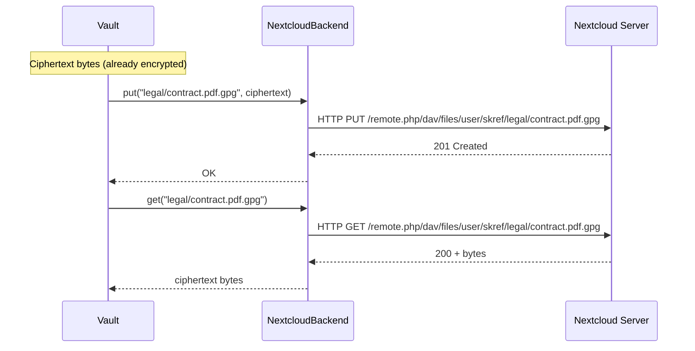

# Phase 2 — Nextcloud / WebDAV Backend

**Status: NOT STARTED**
**Estimated effort: 5-7 days**
**Dependencies: Phase 1 (complete)**
**Agent skill level: Sonnet or above**

---

## Objective

Implement a Nextcloud/WebDAV backend for SKRef so vaults can be stored on any WebDAV-compatible server (Nextcloud, ownCloud, Apache mod_dav, etc.). Files are already GPG-encrypted by the Vault layer before reaching the backend — this backend just does HTTP PUT/GET of ciphertext blobs.

---

## Architecture



---

## Deliverables

### 1. `src/skref/backends/nextcloud.py`

Create a `NextcloudBackend` class implementing the `Backend` interface from `backends/base.py`.

**Constructor parameters:**

```python
class NextcloudBackend(Backend):
    def __init__(
        self,
        url: str,              # WebDAV base URL, e.g. "https://cloud.example.com/remote.php/dav/files/user/skref/"
        username: str,          # Nextcloud username
        password: str,          # App password (NOT the user's login password)
        verify_ssl: bool = True,
        timeout: int = 30,
    ) -> None:
```

**Required methods** (see `backends/base.py` for signatures):

| Method | WebDAV operation | Notes |
|--------|-----------------|-------|
| `put(rel_path, data)` | `PUT` | Create parent directories first via `MKCOL` if needed |
| `get(rel_path)` | `GET` | Return raw bytes. Raise `FileNotFoundError` on 404 |
| `delete(rel_path)` | `DELETE` | No-op if already gone |
| `list_dir(rel_path)` | `PROPFIND Depth:1` | Parse XML response, return `list[FileEntry]` |
| `exists(rel_path)` | `HEAD` or `PROPFIND Depth:0` | Return bool |
| `mkdir(rel_path)` | `MKCOL` | Recursive: create parents if needed |
| `file_size(rel_path)` | `PROPFIND` | Parse `getcontentlength` from response |

**Implementation guidance:**

- Use `requests` library (already in optional deps as `[nextcloud]`)
- Authentication: HTTP Basic Auth with app password
- URL construction: join base URL + relative path, handle trailing slashes
- `PROPFIND` returns XML — parse with `xml.etree.ElementTree` (stdlib)
- WebDAV namespace: `DAV:` — use `{DAV:}response`, `{DAV:}href`, etc.
- Handle Nextcloud's redirect behavior (may 301 to add trailing slash on dirs)
- Timeout all HTTP requests

**Error handling:**

- HTTP 404 → `FileNotFoundError`
- HTTP 401/403 → `PermissionError` with helpful message about app passwords
- HTTP 5xx → `RuntimeError` with status code
- Connection errors → `ConnectionError` with URL

### 2. `tests/test_backend_nextcloud.py`

Tests must work **without a real Nextcloud server** using `unittest.mock` or `responses` library.

**Required test cases:**

| Test | What it verifies |
|------|-----------------|
| `test_put_sends_put_request` | Correct URL, method, body |
| `test_put_creates_parents` | MKCOL called for parent dirs |
| `test_get_returns_bytes` | GET response body returned as bytes |
| `test_get_404_raises` | FileNotFoundError on 404 |
| `test_delete_sends_delete` | Correct DELETE request |
| `test_list_dir_parses_propfind` | XML parsing produces correct FileEntry list |
| `test_exists_true_on_200` | HEAD 200 → True |
| `test_exists_false_on_404` | HEAD 404 → False |
| `test_mkdir_sends_mkcol` | MKCOL with correct URL |
| `test_auth_error_raises` | 401 → PermissionError with message |
| `test_url_construction` | Trailing slashes, path joining |

### 3. Config Integration

Update `cli.py` `_resolve_vault()` to construct `NextcloudBackend` when `vcfg.backend == BackendType.NEXTCLOUD`:

```python
elif vcfg.backend == BackendType.NEXTCLOUD:
    from .backends.nextcloud import NextcloudBackend
    # Credentials: read from config or prompt
    backend = NextcloudBackend(
        url=vcfg.url,
        username=...,  # see credential storage below
        password=...,
    )
```

### 4. Credential Storage

Nextcloud app passwords should NOT be stored in `vaults.yaml` in plaintext. Options (implement at least one):

1. **Environment variables**: `SKREF_NC_USER`, `SKREF_NC_PASS` (simplest, implement this)
2. **System keyring**: `keyring` Python package (nice-to-have)
3. **GPG-encrypted credentials file**: `~/.skcapstone/credentials.gpg` (future)

For Phase 2, implement option 1 (env vars) with a fallback to interactive prompt via `click.prompt()`.

### 5. Registration

- Add `from .nextcloud import NextcloudBackend` to `backends/__init__.py`
- Verify `BackendType.NEXTCLOUD` already exists in `models.py` (it does)
- `VaultConfig.url` field already exists (it does)

---

## WebDAV Protocol Reference

Agents implementing this should know:

```
PUT /path/to/file.gpg HTTP/1.1
→ stores bytes

GET /path/to/file.gpg HTTP/1.1
→ returns bytes

DELETE /path/to/file.gpg HTTP/1.1
→ removes file

MKCOL /path/to/dir/ HTTP/1.1
→ creates directory

PROPFIND /path/ HTTP/1.1
Depth: 1
→ returns XML listing of children
```

Nextcloud WebDAV base URL pattern:
```
https://<host>/remote.php/dav/files/<username>/<folder>/
```

App password: generated in Nextcloud → Settings → Security → "Create new app password".

---

## Acceptance Criteria

- [ ] `NextcloudBackend` passes all 11+ tests
- [ ] `skref put` / `skref ls` / `skref open` work with `backend: nextcloud` in config
- [ ] `skref mount` works with Nextcloud backend (FUSE + WebDAV)
- [ ] Credentials via env vars or interactive prompt (not plaintext in config)
- [ ] Error messages are helpful (e.g., "Create an app password in Nextcloud Settings → Security")
- [ ] No new dependencies beyond `requests` (already in `[nextcloud]` extras)
