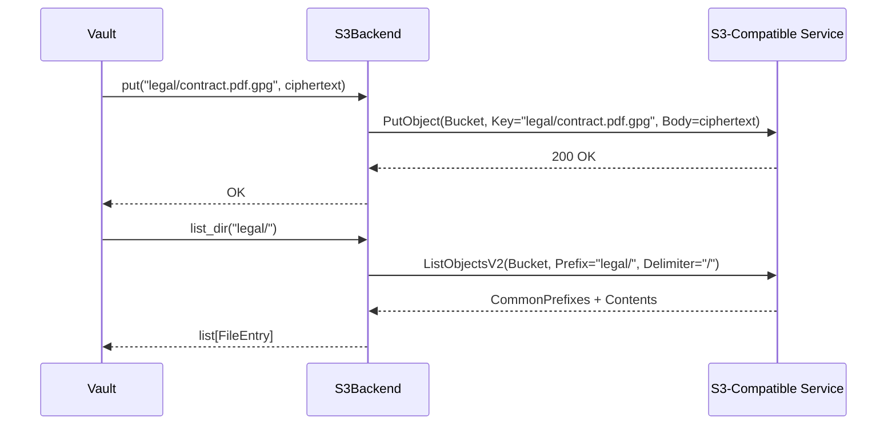

# Phase 3 — S3 / MinIO Backend

**Status: NOT STARTED**
**Estimated effort: 4-5 days**
**Dependencies: Phase 1 (complete)**
**Agent skill level: Sonnet or above**

---

## Objective

Implement an S3-compatible storage backend so vaults can live on AWS S3, MinIO (self-hosted), Wasabi, Backblaze B2, DigitalOcean Spaces, or any S3-compatible provider. The backend stores and retrieves GPG ciphertext blobs — it never sees plaintext.

---

## Architecture



---

## Deliverables

### 1. `src/skref/backends/s3.py`

Create an `S3Backend` class implementing the `Backend` interface.

**Constructor:**

```python
class S3Backend(Backend):
    def __init__(
        self,
        bucket: str,
        prefix: str = "",             # optional key prefix within bucket
        region: str = "us-east-1",
        endpoint_url: str | None = None,  # for MinIO/self-hosted
        access_key: str | None = None,    # None = use default credential chain
        secret_key: str | None = None,
    ) -> None:
```

**Method mapping:**

| Method | S3 Operation | Notes |
|--------|-------------|-------|
| `put(rel_path, data)` | `put_object(Bucket, Key, Body)` | Key = prefix + rel_path |
| `get(rel_path)` | `get_object(Bucket, Key)` | Return `Body.read()`. Raise `FileNotFoundError` on `NoSuchKey` |
| `delete(rel_path)` | `delete_object(Bucket, Key)` | S3 delete is idempotent — no error if missing |
| `list_dir(rel_path)` | `list_objects_v2(Bucket, Prefix, Delimiter="/")` | Parse `Contents` → files, `CommonPrefixes` → dirs |
| `exists(rel_path)` | `head_object(Bucket, Key)` | Return True on 200, False on `ClientError 404` |
| `mkdir(rel_path)` | No-op | S3 has no real directories. Create a zero-byte object with trailing `/` for UI compatibility, or just no-op |
| `file_size(rel_path)` | `head_object` → `ContentLength` | Return 0 if missing |

**Implementation guidance:**

- Use `boto3` (already in optional deps as `[s3]`)
- Create client in `__init__`: `boto3.client("s3", region_name=..., endpoint_url=..., ...)`
- If `access_key` and `secret_key` are provided, pass to client constructor. Otherwise rely on AWS credential chain (env vars, ~/.aws/credentials, IAM role).
- Key construction: `f"{self._prefix}{rel_path}"` — handle empty prefix and double slashes
- `list_dir`: use `Delimiter="/"` to get "folder-like" behavior from flat S3 namespace
  - `CommonPrefixes` → directories (strip prefix, extract last component)
  - `Contents` → files (skip the prefix object itself if present)
  - Handle pagination with `ContinuationToken` for large directories

**MinIO specifics:**

MinIO is 100% S3-compatible. The only difference is `endpoint_url`:

```yaml
# vaults.yaml for MinIO
archive:
  backend: s3
  bucket: my-vault
  region: us-east-1
  url: http://minio.local:9000       # endpoint_url
  encrypted: true
```

Map `VaultConfig.url` → `endpoint_url` in the S3Backend constructor when `backend == "s3"`.

**Error handling:**

- `botocore.exceptions.ClientError` with code `NoSuchKey` or `404` → `FileNotFoundError`
- `botocore.exceptions.ClientError` with code `NoSuchBucket` → `RuntimeError("Bucket not found: ...")`
- `botocore.exceptions.NoCredentialsError` → `RuntimeError("No AWS credentials found. Set AWS_ACCESS_KEY_ID/AWS_SECRET_ACCESS_KEY or configure ~/.aws/credentials")`
- `botocore.exceptions.EndpointConnectionError` → `ConnectionError("Cannot connect to ...")`

### 2. `tests/test_backend_s3.py`

Use `unittest.mock` to mock `boto3.client`. Do NOT require real AWS/MinIO for tests.

**Required test cases:**

| Test | What it verifies |
|------|-----------------|
| `test_put_calls_put_object` | Correct bucket, key, body |
| `test_put_with_prefix` | Key includes prefix |
| `test_get_returns_bytes` | Body stream read and returned |
| `test_get_missing_raises` | NoSuchKey → FileNotFoundError |
| `test_delete_calls_delete_object` | Correct bucket and key |
| `test_list_dir_root` | Parses Contents + CommonPrefixes |
| `test_list_dir_subdirectory` | Prefix includes subdir path |
| `test_list_dir_pagination` | Handles ContinuationToken |
| `test_exists_true` | head_object 200 → True |
| `test_exists_false` | head_object 404 → False |
| `test_file_size` | ContentLength from head_object |
| `test_endpoint_url_for_minio` | Custom endpoint_url passed to client |
| `test_no_credentials_raises` | Helpful error message |

### 3. Config Integration

Update `cli.py` `_resolve_vault()`:

```python
elif vcfg.backend == BackendType.S3:
    from .backends.s3 import S3Backend
    backend = S3Backend(
        bucket=vcfg.bucket,
        prefix=vcfg.path,         # optional prefix within bucket
        region=vcfg.region or "us-east-1",
        endpoint_url=vcfg.url,    # None for AWS, URL for MinIO
    )
```

### 4. Credential Strategy

S3 credentials should use the standard AWS credential chain:

1. **Environment variables**: `AWS_ACCESS_KEY_ID`, `AWS_SECRET_ACCESS_KEY` (standard)
2. **~/.aws/credentials**: boto3 reads this automatically
3. **IAM role**: when running on EC2/ECS (automatic)
4. **Config fields**: `access_key` / `secret_key` in VaultConfig (add to model if needed — but prefer env vars)

For MinIO self-hosted, document that users should set the env vars.

### 5. Registration

- Add `from .s3 import S3Backend` to `backends/__init__.py`
- `BackendType.S3` already exists in `models.py`
- `VaultConfig.bucket` and `VaultConfig.region` already exist
- Map `VaultConfig.url` to `endpoint_url` for MinIO

---

## Example Configurations

### AWS S3

```yaml
vaults:
  archive:
    backend: s3
    bucket: my-skref-archive
    region: us-east-1
    encrypted: true
    key: auto
```

```bash
export AWS_ACCESS_KEY_ID=AKIA...
export AWS_SECRET_ACCESS_KEY=...
skref ls --vault archive
```

### MinIO (self-hosted)

```yaml
vaults:
  minio-vault:
    backend: s3
    bucket: skref
    region: us-east-1
    url: http://minio.local:9000
    encrypted: true
    key: auto
```

```bash
export AWS_ACCESS_KEY_ID=minioadmin
export AWS_SECRET_ACCESS_KEY=minioadmin
skref put backup.tar.gz --vault minio-vault
```

### Backblaze B2 (S3-compatible)

```yaml
vaults:
  b2-vault:
    backend: s3
    bucket: my-b2-bucket
    region: us-west-002
    url: https://s3.us-west-002.backblazeb2.com
    encrypted: true
```

---

## Acceptance Criteria

- [ ] `S3Backend` passes all 13+ tests (mocked, no real AWS)
- [ ] Works with real AWS S3 (manual integration test documented)
- [ ] Works with MinIO via `endpoint_url`
- [ ] `skref put` / `skref ls` / `skref open` / `skref mount` work with S3 backend
- [ ] Credential chain: env vars → ~/.aws/credentials → IAM role
- [ ] Error messages are helpful (bucket not found, no credentials, endpoint unreachable)
- [ ] No dependency beyond `boto3` (already in `[s3]` extras)
- [ ] Large directory listing handled via pagination
