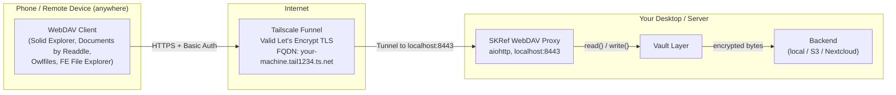
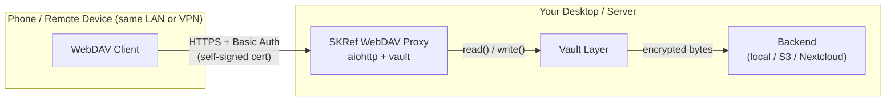
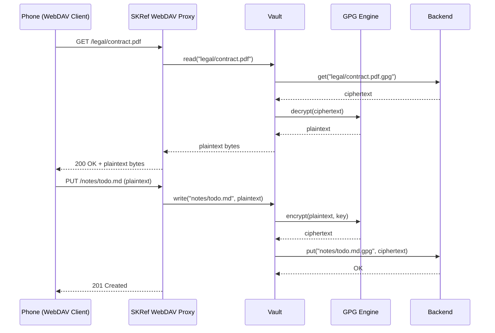

# Phase 4 — WebDAV Proxy Server

**Status: NOT STARTED**
**Estimated effort: 5-7 days**
**Dependencies: Phase 1 (complete), Phase 2 helpful but not required**
**Agent skill level: Sonnet or above**

---

## Objective

Build a WebDAV server that sits in front of a Vault, translating standard WebDAV requests into vault read/write operations. This enables **any device with a WebDAV client** — phones, tablets, remote desktops — to access an encrypted vault without FUSE or GPG installed on the client.

The proxy decrypts on read and encrypts on write, so the client sees plaintext files over an authenticated HTTPS connection.

---

## Architecture

### With Tailscale Funnel (Recommended)



**Why Tailscale Funnel changes everything:**

| Without Tailscale | With Tailscale Funnel |
|---|---|
| Self-signed TLS cert (phone warns) | Valid Let's Encrypt cert (auto) |
| Port forwarding on router | Zero port forwarding |
| Dynamic DNS or static IP | Stable FQDN: `machine.tail1234.ts.net` |
| LAN only (or VPN setup) | Accessible from anywhere |
| Manual firewall rules | Tailscale ACLs handle access |

### Without Tailscale (LAN / Manual)





---

## Why WebDAV Proxy?

| Problem | Solution |
|---------|----------|
| Phone can't run FUSE | WebDAV is natively supported on iOS/Android |
| Phone doesn't have GPG | Proxy handles all crypto |
| Phone storage is limited | Files are streamed on demand, not synced |
| Need access from any device | WebDAV works from any HTTP client |

**Phone apps that support WebDAV natively:**
- **Android:** Solid Explorer, FE File Explorer, Total Commander + WebDAV plugin, Owlfiles
- **iOS:** Documents by Readdle, FE File Explorer, Owlfiles, FileBrowser
- **Desktop fallback:** Any WebDAV client (cadaver, Windows "Map Network Drive", macOS "Connect to Server")

---

## Deliverables

### 1. `src/skref/webdav_proxy.py`

An async WebDAV server built on `aiohttp`.

**Required WebDAV methods:**

| HTTP Method | WebDAV Operation | Handler |
|-------------|-----------------|---------|
| `GET` | Download file | `vault.read(path)` → response body |
| `PUT` | Upload file | request body → `vault.write(path, data)` |
| `DELETE` | Delete file | `vault.delete(path)` |
| `MKCOL` | Create directory | `vault.mkdir(path)` |
| `PROPFIND` | List directory / get properties | `vault.list_dir(path)` → XML response |
| `HEAD` | Check existence + size | `vault.exists(path)` + `vault.file_size(path)` |
| `OPTIONS` | Capabilities | Return `Allow: OPTIONS, GET, PUT, DELETE, MKCOL, PROPFIND, HEAD` |
| `MOVE` | Rename/move file | Read + write + delete (atomic) |
| `COPY` | Copy file | Read source + write dest |

**Server class:**

```python
class WebDAVProxy:
    def __init__(
        self,
        vault: Vault,
        host: str = "127.0.0.1",    # bind address
        port: int = 8443,
        username: str | None = None, # Basic auth username
        password: str | None = None, # Basic auth password
        tls_cert: str | None = None, # path to TLS cert (HTTPS)
        tls_key: str | None = None,  # path to TLS private key
    ) -> None:
        ...

    async def start(self) -> None:
        """Start the WebDAV server."""
        ...

    def run(self) -> None:
        """Blocking entry point (for CLI)."""
        asyncio.run(self.start())
```

**Authentication:**

- **Basic Auth** over HTTPS (required — never run without TLS on non-localhost)
- Username/password from CLI flags, env vars (`SKREF_WEBDAV_USER`, `SKREF_WEBDAV_PASS`), or config
- If binding to `127.0.0.1` (localhost only), allow HTTP for development
- If binding to `0.0.0.0` (network-accessible), REQUIRE TLS cert **or Tailscale Funnel** (which provides TLS automatically)

### Tailscale Funnel Integration

The `--tailscale` flag on `skref serve` automates the entire network exposure:

```python
# In cli.py — already implemented
skref serve --vault personal --tailscale --user me --password secret
```

This calls `src/skref/tailscale.py` which:

1. **Detects** Tailscale: `tailscale status --json` → parse hostname, FQDN, tailnet IP
2. **Configures serve**: `tailscale serve https / http://127.0.0.1:8443` — proxies HTTPS to local HTTP
3. **Enables Funnel**: `tailscale funnel 8443` — makes the FQDN publicly reachable
4. **Reports the URL**: `https://your-machine.tail1234.ts.net:443/`

The WebDAV proxy only binds to `127.0.0.1` (localhost). Tailscale handles all TLS termination and public routing. The proxy never touches a certificate.

**`src/skref/tailscale.py` is already implemented** with these functions:

| Function | Purpose |
|----------|---------|
| `is_installed()` | Check if tailscale CLI exists (Linux, macOS, Windows paths) |
| `auto_install()` | Auto-install Tailscale (curl/brew/winget per platform) |
| `authenticate(auth_key?)` | `tailscale up` with optional auth key for headless join |
| `is_authenticated()` | Check if Tailscale is connected to a tailnet |
| `get_status()` | Parse `tailscale status --json` → TailscaleStatus dataclass |
| `enable_funnel(port)` | Run `tailscale funnel <port>` |
| `disable_funnel(port)` | Run `tailscale funnel off <port>` |
| `serve_background(port)` | Run `tailscale serve https / http://127.0.0.1:<port>` |
| `generate_auth_key()` | Generate reusable auth key via Tailscale API |
| `save_auth_key(key)` | GPG-encrypt auth key → `~/.skcapstone/sync/tailscale.key.gpg` |
| `load_auth_key()` | Decrypt synced auth key for headless device join |
| `has_synced_auth_key()` | Check if encrypted auth key exists in sync folder |
| `get_install_hint()` | Platform-specific install instructions |
| `get_admin_console_url()` | URL to Tailscale admin for manual key generation |

**TailscaleStatus fields:**

```python
@dataclass
class TailscaleStatus:
    running: bool
    hostname: str           # e.g., "my-desktop"
    dns_name: str           # e.g., "my-desktop.tail1234.ts.net."
    tailnet: str            # e.g., "tail1234.ts.net"
    ip4: str                # e.g., "100.64.0.42"
    ip6: str
    funnel_available: bool

    @property
    def fqdn(self) -> str:  # "my-desktop.tail1234.ts.net"
    @property
    def webdav_url(self) -> str:  # "https://my-desktop.tail1234.ts.net:8443/"
```

**PROPFIND response format:**

The server must return valid WebDAV XML. Example for `PROPFIND /legal/ Depth:1`:

```xml
<?xml version="1.0" encoding="utf-8"?>
<D:multistatus xmlns:D="DAV:">
  <D:response>
    <D:href>/legal/</D:href>
    <D:propstat>
      <D:prop>
        <D:resourcetype><D:collection/></D:resourcetype>
        <D:displayname>legal</D:displayname>
      </D:prop>
      <D:status>HTTP/1.1 200 OK</D:status>
    </D:propstat>
  </D:response>
  <D:response>
    <D:href>/legal/contract.pdf</D:href>
    <D:propstat>
      <D:prop>
        <D:resourcetype/>
        <D:displayname>contract.pdf</D:displayname>
        <D:getcontentlength>524288</D:getcontentlength>
        <D:getcontenttype>application/pdf</D:getcontenttype>
      </D:prop>
      <D:status>HTTP/1.1 200 OK</D:status>
    </D:propstat>
  </D:response>
</D:multistatus>
```

**Content-Type detection:**

Use `mimetypes.guess_type()` on plaintext filenames for `getcontenttype`.

### 2. CLI Command: `skref serve`

Add to `cli.py`:

```python
@main.command()
@click.option("--vault", "vault_name", default=None, help="Vault name.")
@click.option("--host", default="127.0.0.1", help="Bind address.")
@click.option("--port", default=8443, type=int, help="Port.")
@click.option("--user", default=None, help="Basic auth username (or SKREF_WEBDAV_USER).")
@click.option("--password", default=None, help="Basic auth password (or SKREF_WEBDAV_PASS).")
@click.option("--tls-cert", default=None, help="TLS certificate file.")
@click.option("--tls-key", default=None, help="TLS private key file.")
def serve(vault_name, host, port, user, password, tls_cert, tls_key):
    """Start a WebDAV proxy server for a vault.

    Access your encrypted vault from any device with a WebDAV client
    (phone, tablet, remote desktop). Files decrypt on read, encrypt
    on write.
    """
```

### 3. `tests/test_webdav_proxy.py`

Use `aiohttp.test_utils.TestClient` to test the server without real network.

**Required test cases:**

| Test | What it verifies |
|------|-----------------|
| `test_get_decrypts_and_returns` | GET returns plaintext bytes |
| `test_get_404` | GET missing file → 404 |
| `test_put_encrypts_and_stores` | PUT body → vault.write called |
| `test_delete_removes` | DELETE → vault.delete called |
| `test_mkcol_creates_dir` | MKCOL → vault.mkdir called |
| `test_propfind_root` | PROPFIND / → valid XML with entries |
| `test_propfind_subdir` | PROPFIND /legal/ → children listed |
| `test_propfind_depth_0` | Depth:0 → only the resource itself |
| `test_head_exists` | HEAD existing file → 200 with Content-Length |
| `test_head_missing` | HEAD missing file → 404 |
| `test_options` | OPTIONS → correct Allow header |
| `test_auth_required` | Request without credentials → 401 |
| `test_auth_wrong_password` | Wrong credentials → 401 |
| `test_auth_success` | Correct credentials → 200 |
| `test_tls_required_on_non_localhost` | Binding to 0.0.0.0 without TLS → error |

### 4. Dependencies

Add to `pyproject.toml`:

```toml
[project.optional-dependencies]
webdav = ["aiohttp>=3.9"]
```

Also add `"aiohttp>=3.9"` to the `all` extras group.

### 5. Self-signed TLS Certificate Generation

Add a helper CLI command or document how to generate:

```bash
# Quick self-signed cert for development/LAN
openssl req -x509 -newkey rsa:4096 -keyout skref-key.pem -out skref-cert.pem \
  -days 365 -nodes -subj '/CN=skref-local'

skref serve --vault personal --tls-cert skref-cert.pem --tls-key skref-key.pem
```

---

## Phone Setup Guide (include in USAGE.md)

### Option A: Tailscale Funnel (Recommended — works from anywhere)

**Desktop:**
```bash
# One command. That's it.
skref serve --vault personal --tailscale --user me --password secret

# Output:
#   Tailscale detected: my-desktop.tail1234.ts.net
#   Public: https://my-desktop.tail1234.ts.net:443/
#   Valid Let's Encrypt TLS certificate
```

**Android — Solid Explorer:**
1. New connection → WebDAV
2. URL: `https://my-desktop.tail1234.ts.net:443/`
3. Username: `me`, Password: `secret`
4. Done — no certificate warnings, works from anywhere (home, office, cellular)

**Android — Owlfiles / FE File Explorer:**
1. Add server → WebDAV
2. URL: `https://my-desktop.tail1234.ts.net:443/`
3. Authenticate
4. Browse your encrypted vault as normal folders/files

**iOS — Documents by Readdle:**
1. Connections → WebDAV Server
2. URL: `https://my-desktop.tail1234.ts.net:443/`
3. Authenticate
4. Open PDFs, view images, edit text — all decrypted on the fly

**iOS — Owlfiles / FE File Explorer:**
1. Add connection → WebDAV
2. Same URL and credentials
3. Works from cellular, coffee shop WiFi, anywhere

### Option B: LAN Only (no Tailscale)

```bash
# Generate a self-signed cert
openssl req -x509 -newkey rsa:4096 -keyout skref-key.pem -out skref-cert.pem \
  -days 365 -nodes -subj '/CN=skref-local'

# Start on LAN
skref serve --vault personal --host 0.0.0.0 --port 8443 \
  --user me --password secret \
  --tls-cert skref-cert.pem --tls-key skref-key.pem
```

Phone connects to `https://<your-lan-ip>:8443/` — but must accept the self-signed cert warning, and only works on the same network.

---

## Security Considerations

- **Plaintext in transit**: The proxy serves decrypted files over the network. TLS is mandatory for non-localhost.
- **Tailscale Funnel**: Provides valid Let's Encrypt TLS automatically. Traffic is encrypted end-to-end through the Tailscale tunnel. The local proxy only binds to localhost.
- **Auth tokens**: Basic Auth credentials are sent with every request. Always over HTTPS (either Tailscale TLS or self-signed).
- **GPG key in memory**: The proxy process has access to the GPG key for decryption. Secure the host machine.
- **Bind to localhost by default**: The proxy always binds to `127.0.0.1`. When using Tailscale, the tunnel handles external routing. Without Tailscale, use `--host 0.0.0.0` explicitly.
- **Tailscale ACLs**: You can further restrict who can reach your Funnel via Tailscale's access control policies.

---

## Acceptance Criteria

- [ ] WebDAV server passes 15+ tests
- [ ] `skref serve` starts and serves a vault
- [ ] GET/PUT/DELETE/MKCOL/PROPFIND/HEAD/OPTIONS all work
- [ ] Phone WebDAV clients (Solid Explorer, Documents by Readdle) can connect and browse
- [ ] Basic Auth required on all requests
- [ ] TLS enforced for non-localhost binding (or Tailscale Funnel)
- [ ] `--tailscale` flag auto-configures Tailscale Serve + Funnel
- [ ] Startup message shows Tailscale FQDN and phone setup URL when using Funnel
- [ ] Works from cellular / remote network (not just LAN) when Funnel is active
- [ ] No plaintext files written to disk (all in-memory)
- [ ] Helpful startup message showing URL, auth hint, phone setup steps
- [ ] Tailscale detection works on Linux, macOS, and Windows
