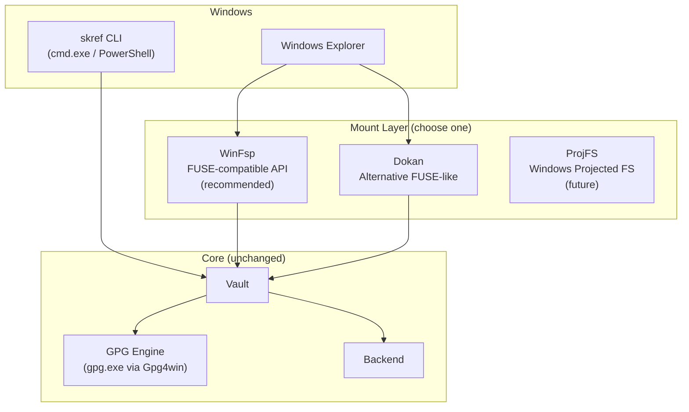

# Phase 5 — Windows Support

**Status: NOT STARTED**
**Estimated effort: 7-10 days**
**Dependencies: Phase 1 (complete)**
**Agent skill level: Opus recommended (OS-level integration)**

---

## Objective

Full Windows support for SKRef: virtual drive mounting (Explorer integration), GPG via Gpg4win, and platform-aware paths. Windows users should have the same experience as Linux FUSE users — mount a vault as a drive letter, browse in Explorer, double-click to open encrypted files.

---

## Architecture



---

## Windows FUSE Options

### Option A: WinFsp (Recommended)

[WinFsp](https://winfsp.dev/) provides a FUSE-compatible API for Windows. It's the most mature option and has a Python binding via `winfspy`.


**Why WinFsp:**
- FUSE semantics: our existing `_SkrefFS` logic (inodes, open/read/write/release) maps almost 1:1
- Drive letter or directory mount point
- Stable, actively maintained
- Free and open source (GPLv3)

**Python binding:** [`winfspy`](https://github.com/Scille/winfspy) — wraps the WinFsp C API.

### Option B: Dokan (Fallback)

[Dokan](https://dokan-dev.github.io/) is an alternative. Use if WinFsp has issues. Python binding: `dokanpy` (less maintained).

### Option C: ProjFS (Future/Experimental)

Windows Projected File System is a first-party Microsoft API. More complex, but no third-party driver needed. Consider for v2.

---

## Deliverables

### 1. `src/skref/fuse_windows.py`

A Windows-specific mount module using `winfspy`.

**Interface mirrors `fuse_mount.py`:**

```python
def check_winfsp_available() -> bool:
    """Check if WinFsp and winfspy are installed."""
    ...

def mount_vault_windows(vault: Vault, mountpoint: str, foreground: bool = True) -> None:
    """Mount a vault as a Windows drive letter or directory.

    Args:
        vault: A Vault instance.
        mountpoint: Drive letter (e.g., "V:") or directory path.
        foreground: Run in foreground (True) or as service.
    """
    ...
```

**WinFsp operation mapping:**

| WinFsp Operation | Vault Method | Notes |
|-----------------|-------------|-------|
| `get_security_by_name` | `vault.exists()` + attrs | Return file attributes for a path |
| `open` | `vault.read()` | Decrypt into memory buffer |
| `read` | in-memory buffer | Return bytes from buffer |
| `write` | in-memory buffer | Modify buffer, mark dirty |
| `cleanup` / `close` | `vault.write()` | Flush dirty buffer (encrypt + store) |
| `read_directory` | `vault.list_dir()` | Yield directory entries |
| `create` | `vault.write(path, b"")` | Create empty file |
| `set_delete` | `vault.delete()` | Mark for deletion |
| `get_volume_info` | static | Return volume name "SKRef", serial, etc. |

**Drive letter vs directory mount:**

```python
if mountpoint.endswith(":"):
    # Drive letter mount: V: → V:\
    winfspy_mount(mountpoint + "\\", ...)
else:
    # Directory mount: C:\Users\me\vault → junction point
    winfspy_mount(mountpoint, ...)
```

### 2. Update `cli.py` Mount Command

Modify the `mount` command to detect Windows and use the appropriate module:

```python
@main.command()
def mount(mountpoint, vault_name, foreground):
    import platform
    if platform.system() == "Windows":
        from .fuse_windows import check_winfsp_available, mount_vault_windows
        if not check_winfsp_available():
            console.print(Panel(
                "WinFsp is required for Windows vault mounting.\n\n"
                "Download: https://winfsp.dev/rel/\n"
                "Then: pip install winfspy",
                title="WinFsp required", border_style="red",
            ))
            sys.exit(1)
        mount_vault_windows(vault, mountpoint, foreground)
    else:
        from .fuse_mount import check_fuse_available, mount_vault
        # existing Linux/macOS code
```

### 3. Platform-Aware Paths

Windows uses different default paths. Update `config.py` and `models.py`:

```python
import platform

if platform.system() == "Windows":
    DEFAULT_CONFIG_PATH = Path(os.environ.get("USERPROFILE", "~")) / ".skcapstone" / "vaults.yaml"
    DEFAULT_IDENTITY_HOME = Path(os.environ.get("USERPROFILE", "~")) / ".skcapstone" / "identity"
    DEFAULT_VAULT_PATH = Path(os.environ.get("USERPROFILE", "~")) / ".skcapstone" / "vaults" / "personal"
else:
    DEFAULT_CONFIG_PATH = Path("~/.skcapstone/vaults.yaml")
    DEFAULT_IDENTITY_HOME = Path("~/.skcapstone/identity")
    DEFAULT_VAULT_PATH = Path("~/.skcapstone/vaults/personal")
```

### 4. GPG on Windows

Gpg4win installs `gpg.exe` to `C:\Program Files (x86)\GnuPG\bin\gpg.exe`. Update `crypto.py`:

```python
def _find_gpg() -> str | None:
    """Find gpg binary, including Gpg4win default location on Windows."""
    if shutil.which("gpg"):
        return "gpg"
    if platform.system() == "Windows":
        gpg4win = Path(r"C:\Program Files (x86)\GnuPG\bin\gpg.exe")
        if gpg4win.exists():
            return str(gpg4win)
        gpg4win_64 = Path(r"C:\Program Files\GnuPG\bin\gpg.exe")
        if gpg4win_64.exists():
            return str(gpg4win_64)
    return None
```

Replace all `shutil.which("gpg")` calls with `_find_gpg()` and use the returned path in subprocess calls.

### 5. Windows Temp Directory for `skref open`

Update `_get_tmpfs_dir()` in `cli.py`:

```python
if platform.system() == "Windows":
    # Windows doesn't have tmpfs. Use %TEMP% with secure permissions.
    tmpdir = os.path.join(os.environ.get("TEMP", tempfile.gettempdir()), "skref-tmp")
    os.makedirs(tmpdir, exist_ok=True)
    return tmpdir
```

### 6. Dependencies

Add to `pyproject.toml`:

```toml
[project.optional-dependencies]
windows = ["winfspy>=2.0"]
```

Add to `all` extras as well, with a platform marker:

```toml
all = [
    "pyfuse3>=3.3; sys_platform != 'win32'",
    "winfspy>=2.0; sys_platform == 'win32'",
    ...
]
```

### 7. `tests/test_fuse_windows.py`

Mock-based tests (don't require actual Windows or WinFsp to run):

| Test | What it verifies |
|------|-----------------|
| `test_check_winfsp_available` | Returns bool based on import |
| `test_drive_letter_mount_format` | "V:" → "V:\\" |
| `test_directory_mount_format` | Path string preserved |
| `test_read_decrypts` | File content returned via vault.read |
| `test_write_encrypts_on_close` | Dirty buffer flushed via vault.write |
| `test_readdir_lists_entries` | vault.list_dir results returned |
| `test_create_empty_file` | vault.write called with empty bytes |
| `test_delete_file` | vault.delete called |
| `test_gpg_path_detection` | Gpg4win paths checked on Windows |

---

## Windows User Experience

### Install

```powershell
# 1. Install Python 3.10+
# 2. Install Gpg4win
#    https://gpg4win.org/download.html
# 3. Install WinFsp
#    https://winfsp.dev/rel/
# 4. Install skref
pip install -e "skref/[windows]"
```

### Usage

```powershell
# Initialize a vault
skref init --name personal --encrypted

# Store a file
skref put C:\Users\me\Documents\contract.pdf --vault personal

# Mount as drive letter
skref mount V: --vault personal
# V:\ now appears in Explorer with your decrypted files!

# Or mount as a folder
skref mount C:\Users\me\vault --vault personal
```

### Explorer Integration

Once mounted, the vault appears in Explorer's sidebar as a regular drive:

```
This PC
├── C: (OS)
├── D: (Data)
└── V: (SKRef - personal)    ← your encrypted vault
    ├── legal/
    │   └── contract.pdf      ← double-click to open (decrypts)
    ├── health/
    │   └── lab-results.pdf
    └── recipes/
        └── bread.md
```

Right-click → Properties shows "SKRef" as the file system type.

---

## Auto-Mount on Login (Windows)

Create a Task Scheduler task:

```powershell
# PowerShell: create a startup task
$action = New-ScheduledTaskAction -Execute "skref" -Argument "mount V: --vault personal --no-foreground"
$trigger = New-ScheduledTaskTrigger -AtLogOn
Register-ScheduledTask -TaskName "SKRef Mount" -Action $action -Trigger $trigger
```

Or add to startup folder: `shell:startup` → create a shortcut to `skref mount V: --vault personal`.

---

## Acceptance Criteria

- [ ] `skref mount V: --vault personal` creates a working Explorer drive on Windows
- [ ] Files decrypt on open, encrypt on save
- [ ] `skref open` works with `os.startfile()` on Windows
- [ ] `skref put` / `skref ls` work with Windows paths (backslashes)
- [ ] GPG detection finds Gpg4win installation
- [ ] Config at `%USERPROFILE%\.skcapstone\vaults.yaml` works
- [ ] WinFsp installation check with helpful download link if missing
- [ ] Tests pass on Linux (mocked) — no Windows CI required
- [ ] Documentation covers PowerShell and cmd.exe usage
