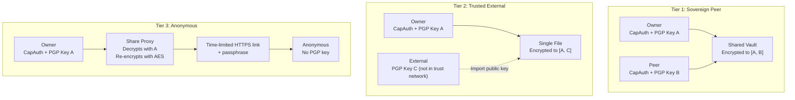
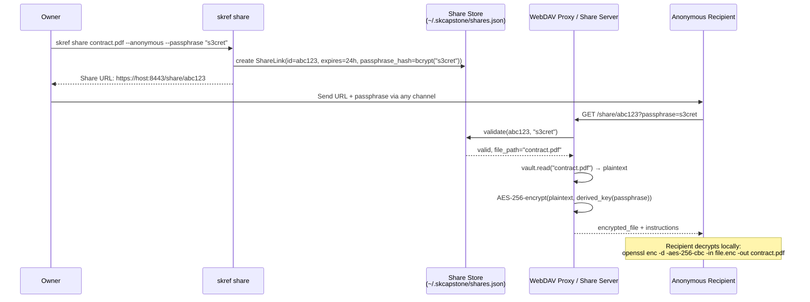
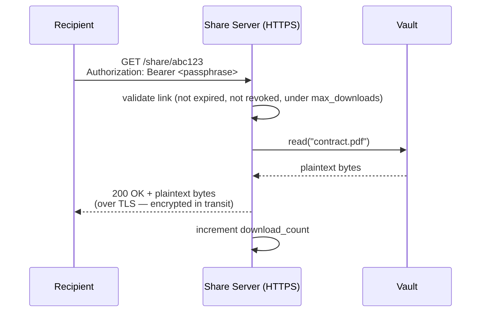

# Phase 6 — Sharing (Sovereign Peers, External, Anonymous)

**Status: NOT STARTED**
**Estimated effort: 7-10 days**
**Dependencies: Phase 1 (complete), Phase 4 (WebDAV proxy) helpful for anonymous sharing**
**Agent skill level: Opus recommended (crypto + protocol design)**

---

## Objective

Enable sharing files from encrypted vaults with three tiers of recipients:

1. **Sovereign Peers** — Both parties have CapAuth identities and PGP keys. Full trust chain. Files encrypted to multiple recipients.
2. **Trusted External** — Recipient has a PGP key but isn't in your trust network. You import their public key and encrypt to them.
3. **Anonymous / Public** — Recipient has no PGP key, no identity. Time-limited download link with passphrase protection.

---

## Sharing Tiers Architecture



---

## Deliverables

### 1. `src/skref/sharing.py` — Share Manager

```python
from __future__ import annotations

from dataclasses import dataclass, field
from enum import Enum
from datetime import datetime, timedelta
from typing import Optional


class ShareTier(str, Enum):
    SOVEREIGN = "sovereign"     # multi-recipient GPG
    EXTERNAL = "external"       # imported PGP key
    ANONYMOUS = "anonymous"     # passphrase-protected link


@dataclass
class ShareLink:
    """Represents a share link for anonymous sharing."""
    id: str                           # unique share ID (uuid4)
    vault_name: str                   # source vault
    file_path: str                    # path within vault
    tier: ShareTier
    created_at: datetime
    expires_at: datetime
    passphrase_hash: str              # bcrypt hash of passphrase
    download_count: int = 0
    max_downloads: int = 10           # rate limit
    recipient_fingerprint: str = ""   # for sovereign/external tiers
    revoked: bool = False


class ShareManager:
    """Manage file sharing across all three tiers."""

    def __init__(self, vault, config) -> None:
        ...

    # --- Tier 1: Sovereign Peer ---

    def add_peer(self, vault_name: str, fingerprint: str) -> None:
        """Add a sovereign peer to a vault's recipient list.

        This re-encrypts all existing files to include the new peer.
        New files will automatically encrypt to all peers.

        Args:
            vault_name: Name of the vault.
            fingerprint: Peer's PGP fingerprint.
        """
        ...

    def remove_peer(self, vault_name: str, fingerprint: str) -> None:
        """Remove a peer and re-encrypt all files without them.

        Args:
            vault_name: Name of the vault.
            fingerprint: Peer's PGP fingerprint to remove.
        """
        ...

    def list_peers(self, vault_name: str) -> list[str]:
        """List all peer fingerprints for a vault."""
        ...

    # --- Tier 2: Trusted External ---

    def share_to_external(
        self,
        file_path: str,
        recipient_fingerprint: str,
        output_path: str | None = None,
    ) -> str:
        """Encrypt a single file to an external PGP key.

        Decrypts the file from the vault, re-encrypts to
        [owner_key, recipient_key], and writes to output_path
        or returns a path.

        Args:
            file_path: Path within the vault.
            recipient_fingerprint: External recipient's PGP fingerprint.
            output_path: Where to write the re-encrypted file.

        Returns:
            Path to the shared encrypted file.
        """
        ...

    def import_external_key(self, key_data: str) -> str:
        """Import an external PGP public key into the keyring.

        Args:
            key_data: ASCII-armored PGP public key.

        Returns:
            Fingerprint of the imported key.
        """
        ...

    # --- Tier 3: Anonymous ---

    def create_anonymous_link(
        self,
        file_path: str,
        passphrase: str,
        expires_in: timedelta = timedelta(hours=24),
        max_downloads: int = 10,
    ) -> ShareLink:
        """Create a time-limited download link for anonymous sharing.

        The file is NOT re-encrypted at creation time. When the
        link is accessed, the share proxy:
        1. Decrypts with the owner's key
        2. Encrypts with AES-256 using a derived key from the passphrase
        3. Streams to the recipient

        Args:
            file_path: Path within the vault.
            passphrase: Passphrase the recipient needs to download.
            expires_in: Link expiration (default 24 hours).
            max_downloads: Maximum download count.

        Returns:
            ShareLink with ID and access details.
        """
        ...

    def revoke_link(self, link_id: str) -> None:
        """Revoke an anonymous share link."""
        ...

    def list_links(self) -> list[ShareLink]:
        """List all active share links."""
        ...
```

### 2. Anonymous Share Flow (Detailed)



**Alternative simpler flow** (if the proxy runs over TLS, the TLS encryption is sufficient — just serve plaintext over HTTPS):



Implement **both options** — let the user choose via `--encrypt-download / --no-encrypt-download`:

- `--encrypt-download` (default for non-TLS): AES wrap + passphrase
- `--no-encrypt-download` (default for TLS): serve plaintext over HTTPS (simpler UX)

### 3. Share Store

`~/.skcapstone/shares.json` — JSON file containing all active share links:

```json
{
  "links": [
    {
      "id": "abc123-...",
      "vault_name": "personal",
      "file_path": "legal/contract.pdf",
      "tier": "anonymous",
      "created_at": "2026-02-25T10:00:00Z",
      "expires_at": "2026-02-26T10:00:00Z",
      "passphrase_hash": "$2b$12$...",
      "download_count": 2,
      "max_downloads": 10,
      "revoked": false
    }
  ]
}
```

### 4. CLI Commands

Add to `cli.py`:

```python
@main.group()
def share():
    """Share files from a vault."""

@share.command("add-peer")
@click.argument("fingerprint")
@click.option("--vault", "vault_name")
def add_peer(fingerprint, vault_name):
    """Add a sovereign peer to a vault (re-encrypts all files)."""

@share.command("remove-peer")
@click.argument("fingerprint")
@click.option("--vault", "vault_name")
def remove_peer(fingerprint, vault_name):
    """Remove a peer from a vault (re-encrypts all files)."""

@share.command("list-peers")
@click.option("--vault", "vault_name")
def list_peers(vault_name):
    """List peers for a vault."""

@share.command("to-external")
@click.argument("file_path")
@click.argument("fingerprint")
@click.option("--vault", "vault_name")
@click.option("--output", default=None)
def to_external(file_path, fingerprint, vault_name, output):
    """Share a file with an external PGP key holder."""

@share.command("link")
@click.argument("file_path")
@click.option("--vault", "vault_name")
@click.option("--passphrase", prompt=True, hide_input=True)
@click.option("--expires", default="24h", help="Expiration: 1h, 24h, 7d")
@click.option("--max-downloads", default=10, type=int)
def create_link(file_path, vault_name, passphrase, expires, max_downloads):
    """Create an anonymous download link with passphrase."""

@share.command("revoke")
@click.argument("link_id")
def revoke(link_id):
    """Revoke a share link."""

@share.command("list-links")
def list_links():
    """List all active share links."""
```

### 5. Share Endpoint in WebDAV Proxy (Phase 4 integration)

Add a `/share/<link_id>` route to `webdav_proxy.py`:

```python
async def handle_share_download(request):
    """Serve an anonymous share link."""
    link_id = request.match_info["link_id"]
    passphrase = request.headers.get("Authorization", "").replace("Bearer ", "")
    # or query param: request.query.get("p", "")

    link = share_store.get(link_id)
    if not link or link.revoked or link.expired:
        return web.Response(status=404, text="Link not found or expired")

    if not bcrypt.checkpw(passphrase.encode(), link.passphrase_hash.encode()):
        return web.Response(status=403, text="Invalid passphrase")

    if link.download_count >= link.max_downloads:
        return web.Response(status=429, text="Download limit reached")

    plaintext = vault.read(link.file_path)
    link.download_count += 1
    share_store.save()

    return web.Response(
        body=plaintext,
        content_type=guess_type(link.file_path),
        headers={"Content-Disposition": f'attachment; filename="{Path(link.file_path).name}"'},
    )
```

### 6. `tests/test_sharing.py`

| Test | What it verifies |
|------|-----------------|
| `test_add_peer_updates_config` | Fingerprint added to peers list |
| `test_remove_peer_updates_config` | Fingerprint removed from peers list |
| `test_list_peers` | Returns current peer fingerprints |
| `test_share_to_external` | Re-encrypts with both owner + external key |
| `test_import_external_key` | GPG keyring updated, fingerprint returned |
| `test_create_anonymous_link` | ShareLink created with correct fields |
| `test_link_expiration` | Expired links rejected |
| `test_link_revocation` | Revoked links rejected |
| `test_link_max_downloads` | Downloads beyond limit rejected |
| `test_passphrase_validation` | Wrong passphrase rejected, correct accepted |
| `test_share_store_persistence` | Links survive save/load cycle |
| `test_download_increments_count` | download_count increases on access |

---

## Security Considerations

### Sovereign Peer Sharing
- **Multi-recipient GPG** is standard OpenPGP. Each recipient decrypts with their own key.
- Adding a peer requires re-encrypting every file in the vault. This is expensive for large vaults — warn the user and show progress.
- Removing a peer also requires full re-encryption (otherwise the removed peer still has copies encrypted to their key).

### External Sharing
- The external key must be imported into the local GPG keyring.
- Trust model: `--trust-model always` (we trust the user's decision to share).
- The shared file is a standard `.gpg` file the recipient can decrypt with their key.

### Anonymous Sharing
- **The passphrase is never stored** — only a bcrypt hash.
- **TLS is mandatory** for serving anonymous links over the network.
- **Link expiration** and **download limits** provide defense in depth.
- **No persistent plaintext**: the proxy decrypts to memory and streams.
- **Audit log**: every download is logged with timestamp and IP (opt-in).

### Re-encryption Performance

For large vaults, re-encryption on `add-peer` or `remove-peer` could take significant time:

```python
async def rekey_vault(vault: Vault, new_peers: list[str], progress_callback=None):
    """Re-encrypt all files in a vault with updated peer list."""
    entries = vault.list_dir_recursive()
    total = len(entries)
    for i, entry in enumerate(entries):
        if not entry.is_dir:
            plaintext = vault.read(entry.path)
            vault.write(entry.path, plaintext)  # writes with new peer list
            if progress_callback:
                progress_callback(i + 1, total)
```

Show a progress bar with `rich.progress` for CLI.

---

## Example Usage

### Sovereign Peer

```bash
# Add a friend's CapAuth identity as a vault peer
skref share add-peer AABB1122CCDD3344... --vault personal
# All files in 'personal' are now encrypted to both your key and theirs

# They can mount the same vault (e.g., synced via Nextcloud/S3)
# and decrypt with their own key
```

### External Recipient

```bash
# Import their public key
gpg --import colleague-pubkey.asc

# Share a single file encrypted to both of you
skref share to-external legal/contract.pdf EEFF5566... --vault personal --output shared-contract.pdf.gpg

# Send shared-contract.pdf.gpg to them via email/Signal/whatever
# They decrypt: gpg --decrypt shared-contract.pdf.gpg
```

### Anonymous (No PGP Key)

```bash
# Create a download link
skref share link legal/contract.pdf --vault personal --passphrase "s3cret" --expires 24h
# → Share URL: https://192.168.1.10:8443/share/abc123-def456

# Send the URL + passphrase to recipient via text/email/Signal
# They open the URL in a browser, enter the passphrase, download the file
# Link expires in 24 hours or after 10 downloads
```

---

## Acceptance Criteria

- [ ] `skref share add-peer` adds a peer and re-encrypts vault files
- [ ] `skref share remove-peer` removes a peer and re-encrypts
- [ ] `skref share to-external` produces a `.gpg` file decryptable by recipient
- [ ] `skref share link` creates a working anonymous download link
- [ ] Anonymous links expire and respect download limits
- [ ] Passphrase is never stored in plaintext (bcrypt hash only)
- [ ] Share proxy endpoint serves files over HTTPS
- [ ] Re-encryption shows progress bar for large vaults
- [ ] All 12+ tests pass
- [ ] Share store persists to `~/.skcapstone/shares.json`
